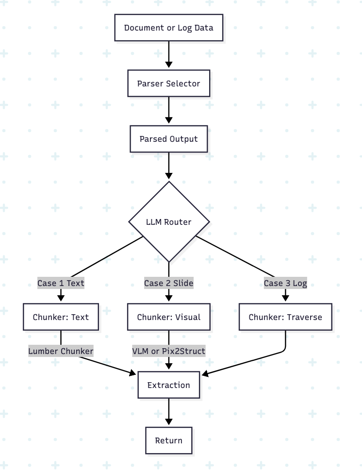

# Peter Parser

Document processing pipeline with optimized modules.

## API (summary)

| Method | Path | Description |
|--------|------|-------------|
| POST | `/parse` | Upload file + `document_type`. PDF for heading/plain/slide; .txt for lifelog. Returns `job_id`. |
| GET | `/status/{job_id}` | Job status: pending \| processing \| completed \| failed |
| GET | `/result/{job_id}` | Parsed chunks (when completed) |

Request: `multipart/form-data` with `file` and `document_type` (heading \| plain \| slide \| lifelog).

## Pipeline flow

Caller provides **document_type** at invoke; there is no automatic routing.

1. **prepare** — Entry point. By `document_type`: **lifelog** → build minimal `ParsedDocument` from raw text (parse skipped); **heading** / **plain** / **slide** → parse document (Upstage) into `ParsedDocument`.
2. **Conditional branch** — Only `slide` → **enrich** (document summary + per-page title/script); `heading` / `plain` / `lifelog` → **chunk** directly.
3. **chunk** — Chunking by document type: HeadingPromptChunker (heading), LumberChunker (plain), VLMChunker (slide), LifelogChunker (lifelog).
4. **chunk_enrich** — Chunk-level metadata (summary, keywords).
5. **export** — Chunks are serialized to JSON in `state["export_json"]`.

## Document type (caller-provided)

| Type      | Description                                      | Input (document)   | Path after prepare   |
|-----------|--------------------------------------------------|--------------------|----------------------|
| `heading` | Structured docs with headings (papers, reports)  | PDF bytes/path     | chunk                |
| `plain`   | Unstructured text (notes, blog body)             | PDF bytes/path      | chunk                |
| `slide`   | Presentation / slide deck                      | PDF bytes/path      | enrich → chunk       |
| `lifelog` | 5W1H event-style daily log                      | **Raw text (str)**  | chunk (LifelogChunker) |

### Lifelog: .txt file or raw text

For **lifelog**, the pipeline does **not** call the document parser; the prepare step builds a minimal `ParsedDocument` from the text and proceeds to chunking.

- **API:** `POST /parse` with **file** = `.txt` and **document_type** = `lifelog`. Upload a text file containing the daily log.
- **Python:** `flow.invoke(document="1/25 10:00\n나\n밥을\n...", document_type="lifelog")` or pass `bytes` (decoded as UTF-8).
- To use a PDF that contains lifelog content, extract text first (e.g. with pymupdf) and save as `.txt` or pass the string. Example: `scripts/test_lifelog_only.py`.

## Plain chunking (LumberChunker, page-unit)

For **plain** documents, the chunk stage uses **LumberChunker** with **page as the section unit**: there is no heading1, so boundaries are detected **within each page** (or each window of `LUMBER_PLAIN_PAGES_PER_SECTION` pages). This avoids overly fine-grained chunks and keeps LLM input small. Each page’s content is split into sentences, the LLM suggests chunk boundaries within that page, and boundaries are mapped to element indices and merged globally.

## Heading chunking (heading documents)

For **heading** documents, the chunk stage uses **HeadingPromptChunker**: content is processed in windows of up to **10 pages** (configurable via `HEADING_CHUNK_MAX_PAGES`). An LLM identifies heading1 / heading2 / heading3 and outputs chunk boundaries by segment (element) index.

- **Input:** Parsed document with `elements` and `pages`; no prior enrichment.
- **Output:** Chunks with element-based boundaries. Each chunk’s `metadata.extra` includes:
  - `heading1`, `heading2`, `heading3` — current heading titles (empty string if absent).
  - `heading_path` — list of non-empty headings, e.g. `["Chapter 1", "1.1 Section"]`.
- **API:** When `heading_path` is present, it is exposed as `ResultItem.metadata.category` so clients can use the heading hierarchy for navigation or filtering.

## Dynamic prompt optimization (slide / VLMChunker only)

Only the **slide** branch’s **chunk** stage is optimized: the two prompts used by **VLMChunker** (`prompt:vlm:boundary_system`, `prompt:vlm:boundary_user`) are loaded from Redis and can be updated by a background batch job that runs the **llm-chunker-optimizer** on collected slide job snapshots.

- **In scope:** slide → enrich → **chunk (VLMChunker)** → chunk_enrich → export; the two boundary-detection prompts above.
- **Out of scope:** enrich prompts, chunk_enrich prompts, **LumberChunker**, **LifelogChunker**, and all other prompts remain unchanged (code/constants).

Flow: slide jobs push `job_id` to `slide_job_queue`; a batch job (e.g. cron) runs `run_vlm_chunk_optimization_batch`, which pops snapshots, evaluates chunks, optimizes the user prompt, and writes both prompts to Redis so the next slide chunk run uses them without restart.

### Setup and trigger

- Install optimizer: `uv sync --extra optimizer`
- Seed prompts once: `uv run python scripts/seed_vlm_prompts.py`
- Enqueue batch (cron or manual): `uv run python scripts/enqueue_vlm_optimization_batch.py`

### Config (env)

| Variable | Description | Default |
|----------|-------------|---------|
| `VLM_OPT_BATCH_SIZE` | Max slide job snapshots per batch | `10` |
| `VLM_OPT_OPENAI_MODEL` | Model used for prompt optimization | `gpt-4` |

Requires `OPENAI_API_KEY` and Redis (`REDIS_URL`) for the optimizer batch.

## Architecture

